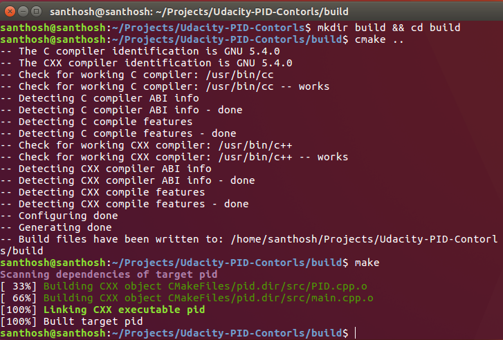

# Controls-PID

 Implement a PID controller in C++ to maneuver the vehicle around the track!

The simulator will provide you the cross track error (CTE) and the velocity (mph) in order to compute the appropriate steering angle.

---

## Dependencies

* cmake >= 3.5

* make >= 4.1(mac, linux), 3.81(Windows)
  * Linux: make is installed by default on most Linux distros
  * Mac: [install Xcode command line tools to get make](https://developer.apple.com/xcode/features/)
  * Windows: [Click here for installation instructions](http://gnuwin32.sourceforge.net/packages/make.htm)
* gcc/g++ >= 5.4
  * Linux: gcc / g++ is installed by default on most Linux distros
  * Mac: same deal as make - [install Xcode command line tools]((https://developer.apple.com/xcode/features/)
  * Windows: recommend using [MinGW](http://www.mingw.org/)
* [uWebSockets](https://github.com/uWebSockets/uWebSockets)
  * Run either `./install-mac.sh` or `./install-ubuntu.sh`.
  * If you install from source, checkout to commit `e94b6e1`, i.e.
    ```
    git clone https://github.com/uWebSockets/uWebSockets 
    cd uWebSockets
    git checkout e94b6e1
    ```
    Some function signatures have changed in v0.14.x. See [this PR](https://github.com/udacity/CarND-MPC-Project/pull/3) for more details.
* Simulator. You can download these from the [Udacity site](https://github.com/udacity/self-driving-car-sim/releases).

## Reflection

### Describe the effect each of the P, I, D components had in your implementation.

The proportional portion of the controller tries to steer the car toward the center line (against the cross-track error). If used along, the car overshoots the central line very easily and go out of the road very quickly. 

The integral portion tries to eliminate a possible bias on the controlled system that could prevent the error to be eliminated. If used along, it makes the car to go in circles. In the case of the simulator, no bias is present. 

The differential portion helps to counteract the proportional trend to overshoot the center line by smoothing the approach to it.

## Basic Build Instructions

1. Clone this repo.
2. Make a build directory: `mkdir build && cd build`
3. Compile: `cmake .. && make`
4. Run it: `./pid`. 



## Code Style

[Google's C++ style guide](https://google.github.io/styleguide/cppguide.html).

## Reflection

### Describe the effect each of the P, I, D components had in your implementation.

The proportional portion of the controller tries to steer the car toward the center line (against the cross-track error). If used along, the car overshoots the central line very easily and go out of the road very quickly. 

The integral portion tries to eliminate a possible bias on the controlled system that could prevent the error to be eliminated. If used along, it makes the car to go in circles. In the case of the simulator, no bias is present. 

The differential portion helps to counteract the proportional trend to overshoot the center line by smoothing the approach to it.

### Describe how the final hyperparameters were chosen.

The parameters were manually choosen by trial and error. Followed the similar step wise as in the session vidoes.

At first, make sure that the car can drive straight with zero as parameters. 

Next, add the proportional and the car start going on following the road but also it starts overshooting and goes out of it. 

Next add the differential to try to overcome the overshooting. After the car drove the track without going out of it, the parameters increased to minimize the average cross-track error on a single track lap. The final parameters where [P: 1.5, I: 0.0, D: 2.5].

## Sample Run

[](https://www.youtube.com/watch?v=a1XxbOdsTkA)

